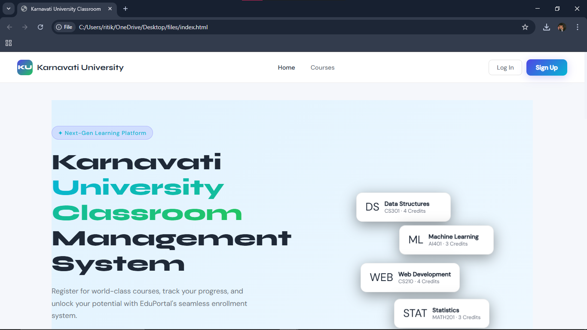
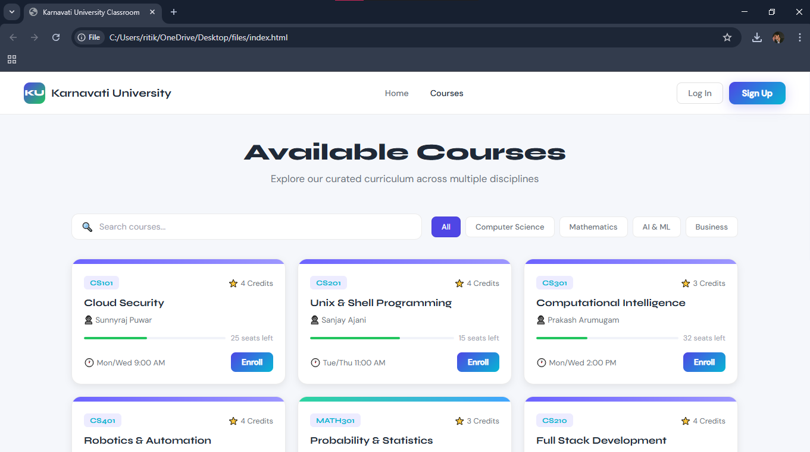
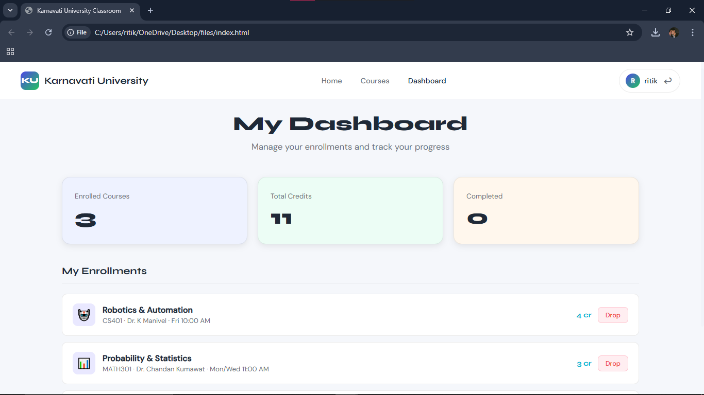
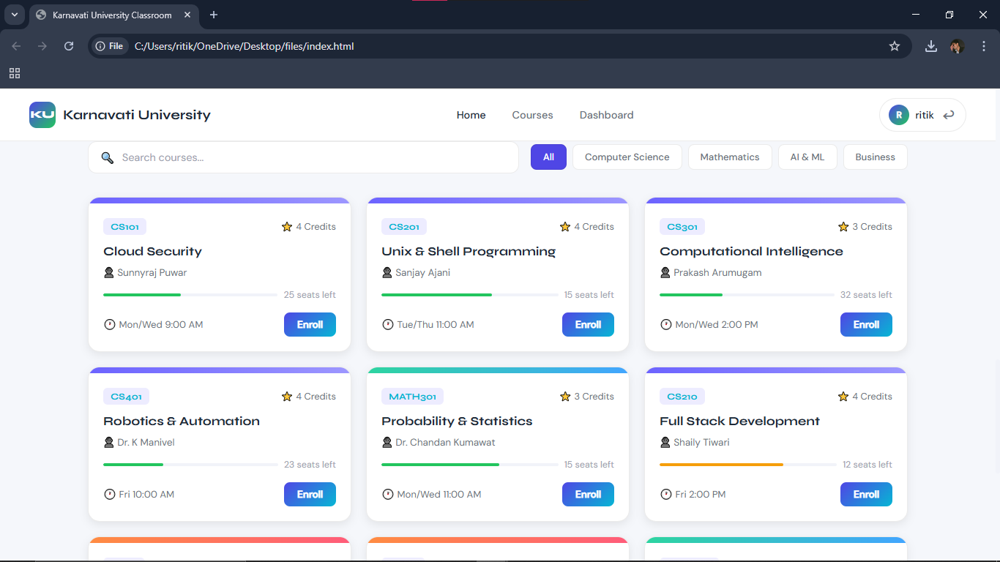

#  Karnavati University Classroom Management System

<p align="center">
  
  
  
</p>

---

##  Project Overview

This project is a **Student Course Registration Web Application** developed for **Karnavati University**.

It allows students to:
- Register & Login securely   
- View available courses 
- Enroll in courses online  
- Track their academic dashboard 

---

##  Features

- User Authentication (Login / Signup)
- Course Listing with Search & Filters
- Enroll / Drop Courses
- ashboard (Credits + Enrollments)
- Real-time UI updates using DOM
- Fetch API with JSON communication
- Fully Responsive Design
- Clean White + Colorful UI

---

## Screenshots

### Home Page


### Courses Page


### Dashboard


### Login Page



## ⚙️ Technologies Used

### Frontend:
- HTML5
- CSS3
- JavaScript (DOM API)

### Backend:
- Node.js
- Express.js

### Database:
- MongoDB (Mongoose)

---

## 🔗 API Usage

- Fetch API used for communication  
- JSON used for data exchange  

---

## 🖥️ How to Run

### 1. Install Dependencies
```bash
npm install

2. Start Server
npm start

3. Open Website
Open index.html in your browser

Key Learning Outcomes:
Full Stack Development
REST API Design
MongoDB CRUD Operations
Authentication using JWT
Responsive UI Design

Author:
Ritik Singh
B.Tech CSE (Semester VI)
Karnavati University

Conclusion:
This project demonstrates a complete Student Course Registration System with a clean UI and efficient backend integration.

Future Scope:
Admin Panel
Payment Integration
Email Notifications
Attendance System
Mobile App Version